# Design Document: AI Content Platform

## Overview

The AI Content Platform is a comprehensive system that leverages artificial intelligence to streamline content creation, management, personalization, and distribution workflows. The platform serves content creators, managers, analysts, and end users by providing intelligent automation, data-driven insights, and personalized experiences.

### Key Design Principles

- **AI-First Architecture**: Core functionality built around AI services for content generation, analysis, and optimization
- **Microservices Design**: Modular, scalable architecture enabling independent service deployment and scaling
- **Real-Time Processing**: Event-driven architecture supporting real-time personalization and analytics
- **API-Centric**: RESTful APIs enabling seamless integration with external tools and systems
- **Security by Design**: End-to-end encryption, role-based access control, and comprehensive audit logging
- **Performance Optimization**: Sub-second response times for user interactions and API calls

## Architecture

### High-Level Architecture

```mermaid
graph TB
    subgraph "Client Layer"
        WEB[Web Application]
        MOBILE[Mobile App]
        API_CLIENT[API Clients]
    end
    
    subgraph "API Gateway"
        GATEWAY[API Gateway]
        AUTH[Authentication Service]
        RATE_LIMIT[Rate Limiting]
    end
    
    subgraph "Core Services"
        CONTENT[Content Service]
        AI[AI Assistant Service]
        PERSON[Personalization Service]
        DIST[Distribution Service]
        ANALYTICS[Analytics Service]
        USER[User Management Service]
    end
    
    subgraph "AI/ML Layer"
        NLP[NLP Models]
        RECOMMEND[Recommendation Engine]
        BEHAVIOR[Behavior Analysis]
        CONTENT_GEN[Content Generation]
    end
    
    subgraph "Data Layer"
        CONTENT_DB[(Content Database)]
        USER_DB[(User Database)]
        ANALYTICS_DB[(Analytics Database)]
        CACHE[(Redis Cache)]
        SEARCH[(Elasticsearch)]
    end
    
    subgraph "External Services"
        AI_API[External AI APIs]
        SOCIAL[Social Media APIs]
        EMAIL[Email Services]
        CDN[Content Delivery Network]
    end
    
    WEB --> GATEWAY
    MOBILE --> GATEWAY
    API_CLIENT --> GATEWAY
    
    GATEWAY --> AUTH
    GATEWAY --> RATE_LIMIT
    GATEWAY --> CONTENT
    GATEWAY --> AI
    GATEWAY --> PERSON
    GATEWAY --> DIST
    GATEWAY --> ANALYTICS
    GATEWAY --> USER
    
    AI --> NLP
    AI --> CONTENT_GEN
    PERSON --> RECOMMEND
    PERSON --> BEHAVIOR
    ANALYTICS --> BEHAVIOR
    
    CONTENT --> CONTENT_DB
    CONTENT --> SEARCH
    USER --> USER_DB
    ANALYTICS --> ANALYTICS_DB
    PERSON --> CACHE
    
    AI --> AI_API
    DIST --> SOCIAL
    DIST --> EMAIL
    CONTENT --> CDN
```



### Service Architecture

The platform follows a microservices architecture with the following core services:

1. **API Gateway**: Central entry point handling authentication, rate limiting, and request routing
2. **Content Service**: Manages content creation, storage, versioning, and organization
3. **AI Assistant Service**: Provides AI-powered content generation and optimization
4. **Personalization Service**: Handles user profiling and content personalization
5. **Distribution Service**: Manages multi-channel content distribution and optimization
6. **Analytics Service**: Processes engagement data and generates performance insights
7. **User Management Service**: Handles authentication, authorization, and user profiles

## Components and Interfaces

### Content Service

**Responsibilities:**
- Content CRUD operations with version control
- Metadata management and automatic tagging
- Full-text search and content discovery
- Collaborative editing with conflict resolution
- Template management and validation

**Key Interfaces:**
```typescript
interface ContentService {
  createContent(content: ContentCreateRequest): Promise<ContentItem>
  updateContent(id: string, updates: ContentUpdateRequest): Promise<ContentItem>
  getContent(id: string): Promise<ContentItem>
  searchContent(query: SearchQuery): Promise<SearchResults>
  getContentVersions(id: string): Promise<ContentVersion[]>
  createTemplate(template: TemplateCreateRequest): Promise<ContentTemplate>
  validateContent(content: ContentItem, template?: ContentTemplate): Promise<ValidationResult>
}
```

### AI Assistant Service

**Responsibilities:**
- Content generation from briefs and prompts
- Content optimization and enhancement suggestions
- Brand guideline compliance checking
- Multi-format content adaptation
- SEO and readability analysis

**Key Interfaces:**
```typescript
interface AIAssistantService {
  generateContent(brief: ContentBrief): Promise<GeneratedContent>
  optimizeContent(content: ContentItem): Promise<OptimizationSuggestions>
  analyzeContent(content: ContentItem): Promise<ContentAnalysis>
  adaptContentFormat(content: ContentItem, targetFormat: ContentFormat): Promise<ContentItem>
  checkBrandCompliance(content: ContentItem, guidelines: BrandGuidelines): Promise<ComplianceReport>
}
```

### Personalization Service

**Responsibilities:**
- User behavior tracking and analysis
- User profile creation and maintenance
- Content recommendation generation
- A/B testing framework
- Behavioral cohort segmentation

**Key Interfaces:**
```typescript
interface PersonalizationService {
  trackUserBehavior(userId: string, event: BehaviorEvent): Promise<void>
  getUserProfile(userId: string): Promise<UserProfile>
  getPersonalizedContent(userId: string, context: PersonalizationContext): Promise<ContentRecommendations>
  createABTest(test: ABTestConfig): Promise<ABTest>
  segmentUsers(criteria: SegmentationCriteria): Promise<UserSegment[]>
}
```

### Distribution Service

**Responsibilities:**
- Multi-channel content distribution
- Optimal timing and channel recommendations
- Cross-platform content formatting
- Distribution performance tracking
- Campaign management

**Key Interfaces:**
```typescript
interface DistributionService {
  distributeContent(content: ContentItem, channels: DistributionChannel[]): Promise<DistributionResult>
  getOptimalChannels(content: ContentItem, audience: TargetAudience): Promise<ChannelRecommendations>
  getOptimalTiming(content: ContentItem, channels: DistributionChannel[]): Promise<TimingRecommendations>
  formatForChannel(content: ContentItem, channel: DistributionChannel): Promise<FormattedContent>
  trackDistributionPerformance(distributionId: string): Promise<DistributionMetrics>
}
```

### Analytics Service

**Responsibilities:**
- Engagement metrics collection and processing
- Performance trend analysis
- ROI calculation and reporting
- Alert generation for performance thresholds
- Report generation and export

**Key Interfaces:**
```typescript
interface AnalyticsService {
  recordEngagement(contentId: string, event: EngagementEvent): Promise<void>
  getContentMetrics(contentId: string, timeRange: TimeRange): Promise<ContentMetrics>
  generatePerformanceReport(criteria: ReportCriteria): Promise<PerformanceReport>
  getEngagementTrends(timeRange: TimeRange): Promise<TrendAnalysis>
  calculateROI(campaignId: string): Promise<ROIMetrics>
}
```

## Data Models

### Core Data Structures

```typescript
interface ContentItem {
  id: string
  title: string
  body: string
  contentType: ContentType
  format: ContentFormat
  metadata: ContentMetadata
  tags: string[]
  authorId: string
  status: ContentStatus
  createdAt: Date
  updatedAt: Date
  version: number
  templateId?: string
  brandGuidelineIds: string[]
}

interface UserProfile {
  userId: string
  demographics: UserDemographics
  preferences: ContentPreferences
  behaviorHistory: BehaviorEvent[]
  engagementPatterns: EngagementPattern[]
  segmentIds: string[]
  lastUpdated: Date
  privacySettings: PrivacySettings
}

interface ContentMetadata {
  description: string
  keywords: string[]
  targetAudience: TargetAudience
  language: string
  readingLevel: ReadingLevel
  estimatedReadTime: number
  seoScore: number
  brandComplianceScore: number
}

interface EngagementEvent {
  eventId: string
  userId: string
  contentId: string
  eventType: EngagementType
  timestamp: Date
  sessionId: string
  deviceInfo: DeviceInfo
  channelId: string
  duration?: number
  metadata: Record<string, any>
}

interface DistributionChannel {
  channelId: string
  name: string
  type: ChannelType
  platform: string
  configuration: ChannelConfiguration
  formatRequirements: FormatRequirements
  audienceReach: number
  averageEngagement: number
}

interface ContentTemplate {
  templateId: string
  name: string
  description: string
  contentType: ContentType
  structure: TemplateStructure
  requiredFields: TemplateField[]
  optionalFields: TemplateField[]
  validationRules: ValidationRule[]
  brandGuidelineIds: string[]
  createdBy: string
  createdAt: Date
}
```

### Database Schema Design

**Content Database (PostgreSQL)**
- Optimized for ACID transactions and complex queries
- Supports full-text search with GIN indexes
- Implements row-level security for multi-tenant access

**User Database (PostgreSQL)**
- Stores user profiles and authentication data
- Implements encryption for sensitive personal information
- Supports efficient querying for personalization

**Analytics Database (ClickHouse)**
- Columnar database optimized for analytical queries
- Handles high-volume event ingestion
- Supports real-time aggregations and reporting

**Cache Layer (Redis)**
- Stores frequently accessed user profiles and content
- Implements session management and rate limiting
- Supports real-time personalization data

**Search Index (Elasticsearch)**
- Full-text search across all content
- Faceted search with metadata filtering
- Auto-complete and suggestion capabilities

## API Specifications

### RESTful API Design

The platform exposes RESTful APIs following OpenAPI 3.0 specifications with the following design principles:

- **Resource-based URLs**: `/api/v1/content/{id}`
- **HTTP methods**: GET, POST, PUT, PATCH, DELETE
- **Status codes**: Proper HTTP status codes for all responses
- **Pagination**: Cursor-based pagination for large result sets
- **Filtering**: Query parameters for filtering and sorting
- **Versioning**: URL-based versioning (`/api/v1/`)

### Core API Endpoints

```yaml
# Content Management API
GET    /api/v1/content                    # List content with filtering
POST   /api/v1/content                    # Create new content
GET    /api/v1/content/{id}               # Get specific content
PUT    /api/v1/content/{id}               # Update content
DELETE /api/v1/content/{id}               # Delete content
GET    /api/v1/content/{id}/versions      # Get content versions
POST   /api/v1/content/{id}/collaborate   # Start collaborative session

# AI Assistant API
POST   /api/v1/ai/generate                # Generate content from brief
POST   /api/v1/ai/optimize                # Optimize existing content
POST   /api/v1/ai/analyze                 # Analyze content quality
POST   /api/v1/ai/adapt                   # Adapt content format

# Personalization API
GET    /api/v1/users/{id}/profile         # Get user profile
POST   /api/v1/users/{id}/behavior        # Track behavior event
GET    /api/v1/users/{id}/recommendations # Get personalized content
POST   /api/v1/personalization/ab-test    # Create A/B test

# Distribution API
POST   /api/v1/distribution/distribute    # Distribute content
GET    /api/v1/distribution/channels      # Get available channels
POST   /api/v1/distribution/optimize      # Get distribution recommendations
GET    /api/v1/distribution/{id}/metrics  # Get distribution performance

# Analytics API
GET    /api/v1/analytics/content/{id}     # Get content metrics
GET    /api/v1/analytics/trends           # Get engagement trends
POST   /api/v1/analytics/reports          # Generate custom report
GET    /api/v1/analytics/roi/{campaignId} # Get ROI metrics
```

### Authentication and Authorization

**Authentication Methods:**
- OAuth 2.0 with PKCE for web applications
- API keys for server-to-server communication
- JWT tokens for session management

**Authorization Model:**
- Role-based access control (RBAC)
- Resource-level permissions
- Attribute-based access control for fine-grained permissions

```typescript
interface UserRole {
  roleId: string
  name: string
  permissions: Permission[]
  resourceScopes: ResourceScope[]
}

interface Permission {
  action: string // 'create', 'read', 'update', 'delete'
  resource: string // 'content', 'user', 'analytics'
  conditions?: AccessCondition[]
}
```

## Error Handling

### Error Response Format

All API errors follow a consistent format:

```typescript
interface ErrorResponse {
  error: {
    code: string
    message: string
    details?: Record<string, any>
    timestamp: string
    requestId: string
  }
}
```

### Error Categories

1. **Client Errors (4xx)**
   - `400 Bad Request`: Invalid request format or parameters
   - `401 Unauthorized`: Authentication required or invalid
   - `403 Forbidden`: Insufficient permissions
   - `404 Not Found`: Resource does not exist
   - `409 Conflict`: Resource conflict (e.g., version mismatch)
   - `422 Unprocessable Entity`: Validation errors

2. **Server Errors (5xx)**
   - `500 Internal Server Error`: Unexpected server error
   - `502 Bad Gateway`: External service unavailable
   - `503 Service Unavailable`: Service temporarily unavailable
   - `504 Gateway Timeout`: External service timeout

### Error Handling Strategies

- **Circuit Breaker Pattern**: Prevent cascading failures from external services
- **Retry Logic**: Exponential backoff for transient failures
- **Graceful Degradation**: Fallback responses when AI services are unavailable
- **Error Logging**: Comprehensive error logging with correlation IDs
- **User-Friendly Messages**: Clear, actionable error messages for end users

## Testing Strategy

The platform employs a comprehensive testing strategy combining unit tests, integration tests, and property-based tests to ensure correctness and reliability.

### Testing Approach

**Unit Testing**:
- Test individual components and functions in isolation
- Mock external dependencies and services
- Focus on edge cases and error conditions
- Target 90%+ code coverage for critical paths

**Integration Testing**:
- Test service-to-service communication
- Validate API contracts and data flow
- Test database interactions and transactions
- Verify external service integrations

**Property-Based Testing**:
- Validate universal properties across all inputs
- Test system invariants and business rules
- Ensure data consistency and integrity
- Verify performance characteristics under load

**End-to-End Testing**:
- Test complete user workflows
- Validate cross-service functionality
- Test real-world scenarios and use cases
- Performance and load testing

### Testing Configuration

- **Property tests**: Minimum 100 iterations per test
- **Test data**: Generated test data for comprehensive coverage
- **CI/CD Integration**: Automated testing in deployment pipeline
- **Performance benchmarks**: Response time and throughput validation
- **Security testing**: Automated vulnerability scanning and penetration testing

Each property-based test references its corresponding design property using the format:
**Feature: ai-content-platform, Property {number}: {property_text}**

## Correctness Properties

*A property is a characteristic or behavior that should hold true across all valid executions of a system—essentially, a formal statement about what the system should do. Properties serve as the bridge between human-readable specifications and machine-verifiable correctness guarantees.*

Based on the requirements analysis, the following correctness properties ensure the AI Content Platform operates correctly across all scenarios:

### Property 1: AI Content Generation Performance and Quality
*For any* valid content brief or existing content, the AI Assistant should generate or optimize content within 30 seconds while maintaining brand compliance and supporting all specified content formats (text, social media, marketing copy).
**Validates: Requirements 1.1, 1.2, 1.3, 1.4, 1.5**

### Property 2: Content Management and Organization
*For any* content item created or imported, the system should automatically categorize and tag the content, maintain complete version control with revision history, and return relevant search results within 2 seconds.
**Validates: Requirements 2.1, 2.2, 2.3**

### Property 3: Collaborative Editing Consistency
*For any* concurrent editing session, the system should handle real-time updates and resolve conflicts while maintaining content integrity and notifying relevant stakeholders of status changes.
**Validates: Requirements 2.4, 2.5**

### Property 4: User Behavior Tracking and Profiling
*For any* user interaction with content, the system should capture engagement data, create and maintain accurate user profiles, and update profiles within 24 hours when behavior changes significantly.
**Validates: Requirements 3.1, 3.2, 3.5**

### Property 5: Behavioral Analysis and Segmentation
*For any* user behavior data, the system should identify content preferences and consumption patterns, and segment users into appropriate behavioral cohorts for targeted delivery.
**Validates: Requirements 3.3, 3.4**

### Property 6: Content Personalization Engine
*For any* user request for content, the personalization engine should customize recommendations based on user profiles, adapt presentation for device/context, and rank content by predicted interest and relevance.
**Validates: Requirements 4.1, 4.2, 4.3**

### Property 7: Personalization Fallback and Testing
*For any* user without available preferences, the system should provide default recommendations based on popular content, and support A/B testing of personalized content variations.
**Validates: Requirements 4.4, 4.5**

### Property 8: Distribution Channel Optimization
*For any* content ready for distribution, the system should recommend optimal channels based on content type and audience, suggest optimal timing based on activity patterns, and identify the most effective channels for specific content types.
**Validates: Requirements 5.1, 5.2, 5.3**

### Property 9: Distribution Performance Analysis
*For any* distribution campaign, the system should provide cross-channel performance comparisons and prioritize channels and timing to maximize specified goal achievement.
**Validates: Requirements 5.4, 5.5**

### Property 10: Comprehensive Analytics and Reporting
*For any* content item across all distribution channels, the system should track engagement metrics, provide performance insights and trends, calculate ROI metrics, and generate exportable reports in multiple formats.
**Validates: Requirements 6.1, 6.2, 6.3, 6.5**

### Property 11: Performance Threshold Monitoring
*For any* performance threshold configuration, the system should send automated alerts to relevant stakeholders when thresholds are met or missed.
**Validates: Requirements 6.4**

### Property 12: Template-Based Content Creation
*For any* content template usage, the system should populate fields with relevant suggestions and placeholders, allow saving of custom templates, maintain version control for template changes, and validate content against template requirements.
**Validates: Requirements 7.2, 7.3, 7.4, 7.5**

### Property 13: Multi-Channel Content Adaptation
*For any* content selected for multi-channel distribution, the system should automatically format content for each channel's requirements while maintaining consistency, update formatting rules when channel specifications change, provide preview functionality, and give specific feedback when adaptation fails validation.
**Validates: Requirements 8.1, 8.2, 8.3, 8.4, 8.5**

### Property 14: Security and Access Control
*For any* user action or data operation, the system should enforce role-based access control with granular permissions, deny unauthorized access while logging security events, encrypt all data at rest and in transit, maintain comprehensive audit logs, and automatically respond to suspicious activity with alerts and access restrictions.
**Validates: Requirements 9.1, 9.2, 9.3, 9.4, 9.5**

### Property 15: API Performance and Integration
*For any* API request, the system should respond within 500ms for standard operations, support webhook notifications for content events, and provide authentication through standard methods including OAuth 2.0 and API keys.
**Validates: Requirements 10.2, 10.3, 10.5**

### Property 16: Content Serialization Round Trip
*For any* valid content object, serializing to storage format then deserializing should produce an equivalent content object with all metadata and relationships preserved.
**Validates: Requirements 2.1, 2.2**

### Property 17: User Profile Serialization Round Trip
*For any* valid user profile object, serializing to storage format then deserializing should produce an equivalent profile with all behavior history and preferences preserved.
**Validates: Requirements 3.2, 3.5**

### Property 18: Template Validation Consistency
*For any* content created from a template, validation should consistently enforce the same requirements regardless of creation method or user role.
**Validates: Requirements 7.5**

### Property 19: Distribution Channel Format Idempotence
*For any* content adapted for a specific channel, applying the same channel formatting rules multiple times should produce identical results.
**Validates: Requirements 8.1, 8.2**

### Property 20: Analytics Data Integrity
*For any* engagement event recorded, the event should be accurately reflected in all relevant analytics aggregations and reports without data loss or corruption.
**Validates: Requirements 6.1, 6.2**
## Implementation Considerations

### Technology Stack Recommendations

**Backend Services:**
- **Node.js/TypeScript**: Primary runtime for API services and business logic
- **PostgreSQL**: Primary database for content, users, and transactional data
- **ClickHouse**: Analytics database for high-volume event processing
- **Redis**: Caching layer and session management
- **Elasticsearch**: Full-text search and content discovery
- **Docker/Kubernetes**: Containerization and orchestration

**AI/ML Integration:**
- **OpenAI GPT-4**: Content generation and optimization
- **Hugging Face Transformers**: Custom NLP models for content analysis
- **TensorFlow/PyTorch**: Custom recommendation models
- **Apache Kafka**: Event streaming for real-time analytics

**Frontend Technologies:**
- **React/TypeScript**: Web application framework
- **Next.js**: Server-side rendering and API routes
- **Tailwind CSS**: Utility-first CSS framework
- **React Query**: Data fetching and state management

### Scalability Considerations

**Horizontal Scaling:**
- Microservices architecture enables independent scaling
- Load balancers distribute traffic across service instances
- Database read replicas for improved read performance
- CDN integration for global content delivery

**Performance Optimization:**
- Caching strategies at multiple layers (Redis, CDN, application)
- Database indexing for frequently queried fields
- Asynchronous processing for heavy operations
- Connection pooling for database efficiency

**Data Partitioning:**
- Content partitioned by creation date and organization
- User data partitioned by geographic region
- Analytics data partitioned by time windows
- Search indices partitioned by content type

### Security Implementation

**Data Protection:**
- AES-256 encryption for data at rest
- TLS 1.3 for data in transit
- Field-level encryption for sensitive user data
- Regular security audits and penetration testing

**Access Control:**
- JWT tokens with short expiration times
- Refresh token rotation for enhanced security
- Rate limiting to prevent abuse
- IP whitelisting for administrative functions

**Compliance:**
- GDPR compliance for EU users
- CCPA compliance for California users
- SOC 2 Type II certification
- Regular compliance audits

### Monitoring and Observability

**Application Monitoring:**
- Distributed tracing with OpenTelemetry
- Metrics collection with Prometheus
- Log aggregation with ELK stack
- Real-time alerting with PagerDuty

**Performance Monitoring:**
- API response time tracking
- Database query performance monitoring
- AI service latency monitoring
- User experience metrics (Core Web Vitals)

**Business Metrics:**
- Content creation velocity
- User engagement rates
- Personalization effectiveness
- Distribution channel performance

### Deployment Strategy

**CI/CD Pipeline:**
- Automated testing on every commit
- Staging environment for integration testing
- Blue-green deployment for zero-downtime releases
- Automated rollback on deployment failures

**Infrastructure as Code:**
- Terraform for cloud resource provisioning
- Kubernetes manifests for application deployment
- Helm charts for configuration management
- GitOps workflow for deployment automation

**Environment Management:**
- Development, staging, and production environments
- Feature flags for gradual feature rollouts
- Database migration strategies
- Configuration management with environment variables

## Future Enhancements

### Phase 2 Features

**Advanced AI Capabilities:**
- Multi-modal content generation (text, images, video)
- Voice-to-text content creation
- Automated content translation
- AI-powered content scheduling optimization

**Enhanced Personalization:**
- Real-time personalization based on current context
- Cross-device user experience continuity
- Predictive content recommendations
- Dynamic content adaptation based on engagement

**Advanced Analytics:**
- Predictive analytics for content performance
- Attribution modeling for multi-channel campaigns
- Competitive analysis and benchmarking
- Advanced cohort analysis and retention metrics

### Integration Opportunities

**Third-Party Integrations:**
- CRM systems (Salesforce, HubSpot)
- Marketing automation platforms (Marketo, Pardot)
- Social media management tools (Hootsuite, Buffer)
- Design tools (Figma, Canva)
- Email marketing platforms (Mailchimp, SendGrid)

**Enterprise Features:**
- Single sign-on (SSO) integration
- Advanced workflow automation
- Custom branding and white-labeling
- Enterprise-grade SLA and support
- Advanced compliance and governance features

### Research and Development

**Emerging Technologies:**
- Large Language Model fine-tuning for domain-specific content
- Computer vision for automated image content analysis
- Natural language processing for sentiment analysis
- Machine learning for predictive content optimization

**Innovation Areas:**
- Blockchain for content authenticity and rights management
- Augmented reality for immersive content experiences
- Voice interfaces for hands-free content creation
- Edge computing for reduced latency in global deployments

## Conclusion

The AI Content Platform design provides a comprehensive, scalable, and secure foundation for intelligent content creation, management, and distribution. The microservices architecture enables independent scaling and deployment of components, while the property-based testing approach ensures system correctness across all scenarios.

The design addresses all functional requirements while maintaining flexibility for future enhancements and integrations. The emphasis on AI-driven automation, real-time personalization, and comprehensive analytics positions the platform to deliver significant value to content creators and organizations.

Key success factors for implementation include:
- Robust testing strategy combining unit, integration, and property-based tests
- Comprehensive monitoring and observability from day one
- Security-first approach with encryption and access controls
- Performance optimization for sub-second response times
- Scalable architecture supporting growth from startup to enterprise scale

The platform's modular design and API-first approach ensure it can evolve with changing business needs and integrate seamlessly with existing tools and workflows.